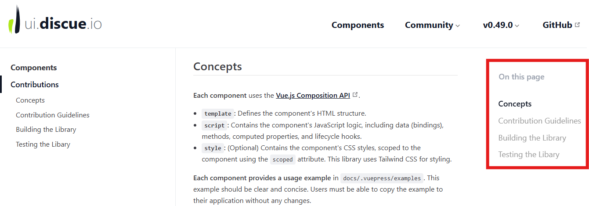

<p align="center"><a href="https://www.discue.io/" target="_blank" rel="noopener noreferrer"></a></p>

<br/>
<div align="center">

[](https://github.com/discue/vuepress-plugin-outline/releases/)
[](https://www.npmjs.com/package/@discue/vuepress-plugin-outline)
[](https://www.npmjs.com/package/@discue/vuepress-plugin-outline)
<br/>
[](https://www.npmjs.com/package/@discue/vuepress-plugin-outline)
[](https://www.npmjs.com/package/@discue/vuepress-plugin-outline)
<br/>
[](/CONTRIBUTING.md "Go to contributions doc")
[](https://nodejs.org "Go to Node.js homepage")

</div>

<br/>

# vuepress-plugin-outline

A plugin for [VuePress](https://vuepress.vuejs.org/) that adds an outline to the right of the screen. 



**Note:** This plugin is specifically designed for discue documentation sites (like [ui.discue.io](https://ui.discue.io)) and might not be suitable for your project unless you're using or basing your theme on the discue theme.

## 📦 Installation

Install the package via npm

```bash
npm install -D @discue/vuepress-plugin-outline
```

## 🚀 Usage
Register the plugin in your `vuepress` config. 

```js
// ./configs/plugins.js
import outlinePlugin from '@discue/vuepress-plugin-outline';

export default [
    // .. other plugins
    outlinePlugin(),
]
```

```js
// ./config.js
import { viteBundler } from '@vuepress/bundler-vite';
import { defineUserConfig } from '@vuepress/cli';
import plugins from './configs/plugins.js';
import defaultTheme from './theme/index.js';

export default defineUserConfig({
    bundler: viteBundler(),
    lang: 'en-US',
    title: 'My Docs',
    theme: defaultTheme({
        // .. theme configuration
    }),
    plugins,
})
```

## 📄 License

[ISC](https://opensource.org/license/isc-license-txt)

